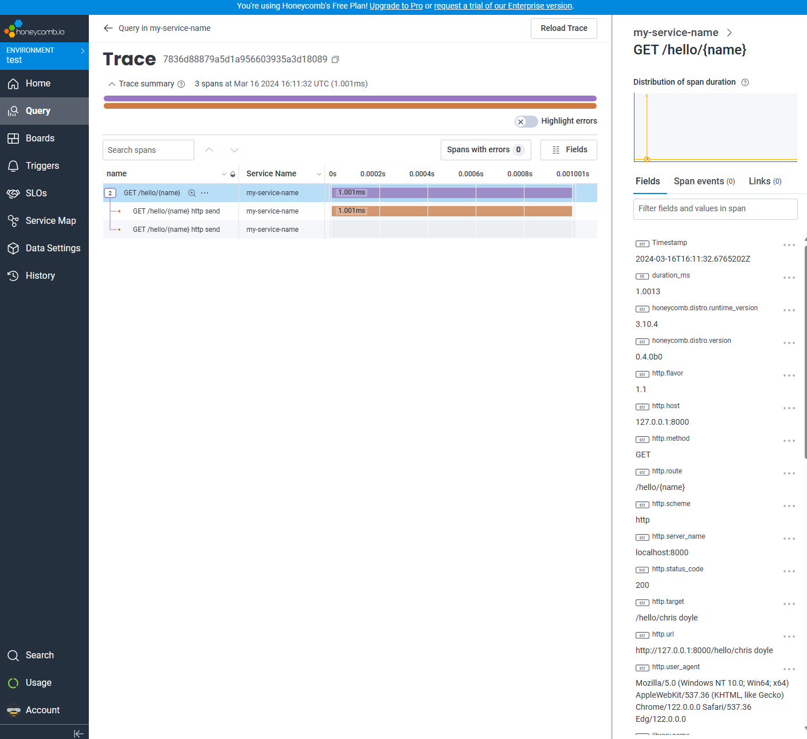
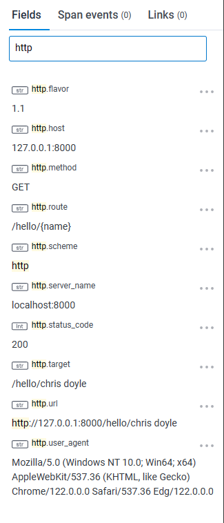
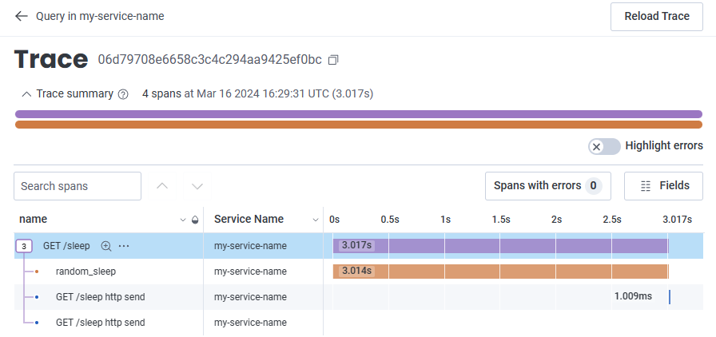
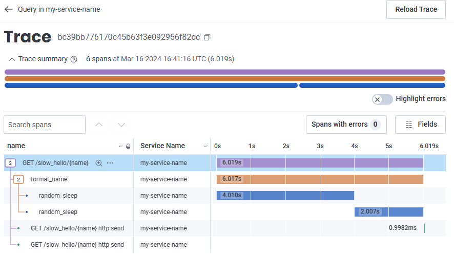
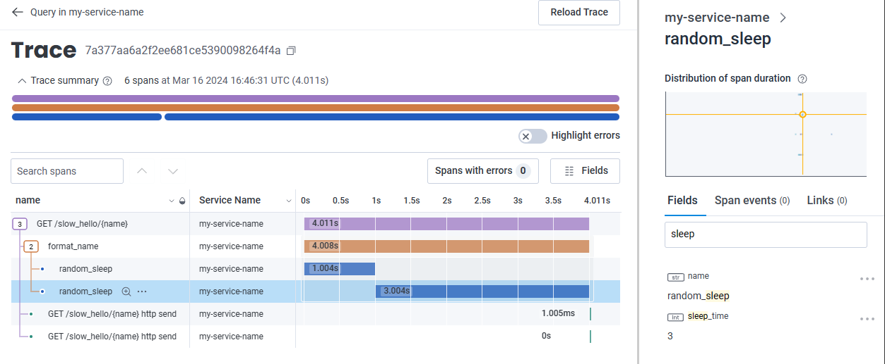
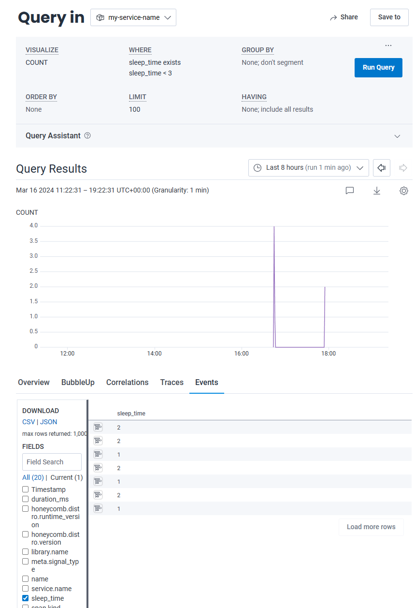
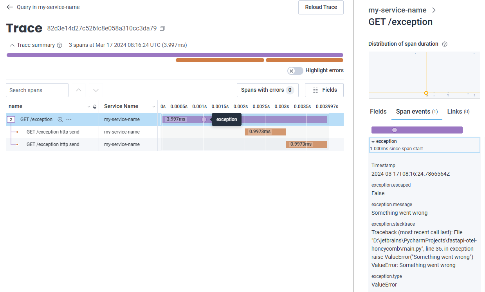
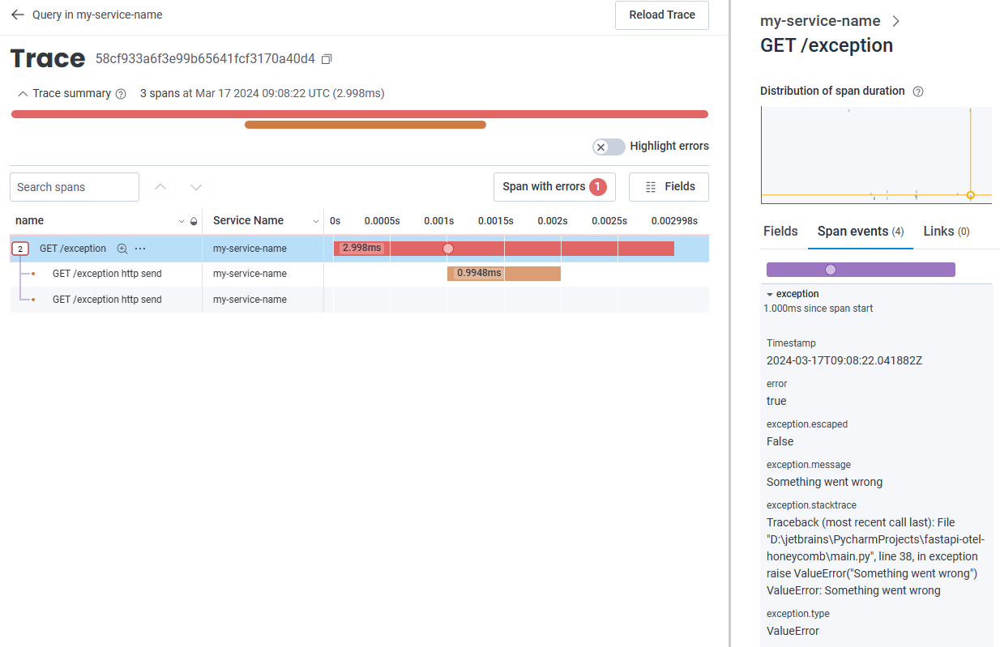
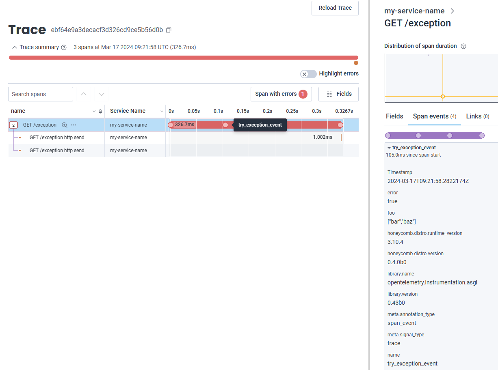

# OTEl Example with FastAPI

This repo is an annotated fastapi example that uses honeycomb as the destination for OTEL traffic. It is using honeycombs
own [distro](https://pypi.org/project/honeycomb-opentelemetry/) for easy integration of OTEL. However also uses OTEL
package to add attributes to spans or start new spans.

In this example we are using [honeycomb](https://www.honeycomb.io/) as the backend for the telemetry data. Honeycomb 
provides a free tier allowing you to ingest 20million events per month.

The [get-started doc](https://docs.honeycomb.io/get-started/start-building/application/) has good working examples that
were used to build this setup.

# Setup

## pip
Install the honeycomb-opentelemetry distro in a virtual env with the below command. Note that the `--pre` flag is 
important because the package is still in `beta`.

```shell
python -m pip install opentelemetry-distro[otlp] fastapi uvicorn --pre
```

Alternatively you can set up the environment from the requirements file. If you do this you can skip the auto instrument
section below.

```shell
pip install -r requirements.txt
```

## Auto Instrument
OTEL provides several packages that will auto instrument our code. In this example it will generate events/spans with 
trace ids for the inbound and outbound requests to our app. This is a good starting point so we need to pull in these 
instrumentation packages. the below command will pull in all auto-instrumentation packages. For the purpose of this demo
this is fine.

```shell
opentelemetry-bootstrap --action=install
```

## Environment
In order to be able to ship our data to the honeycomb backend we need to set the following environment variables. You 
can create an API key from your honeycomb account, and the service name is what ever you want this to show under in the
backend. Here we are just directly exporting to the backend rather than using OTEL collector.

```shell
export OTEL_EXPORTER_OTLP_ENDPOINT=https://api.honeycomb.io
export OTEL_EXPORTER_OTLP_HEADERS=x-honeycomb-team\=hcaik_01hs5pepeqbjkXXXXXXXXXXXXXXXXXXXXXXX5wz16aka11crdd152p
export OTEL_SERVICE_NAME=my-service-name
```

# Running
In order to run this we use a command opentelemetry packages installed for us. We pass the command to run under 
instrumentation

```shell
opentelemetry-instrument python main.py

INFO:     Started server process [21264]
INFO:     Waiting for application startup.
INFO:     Application startup complete.
INFO:     Uvicorn running on http://0.0.0.0:8000 (Press CTRL+C to quit)
```

# Traces, Spans and events

## Auto instrumented trace
We can look at a single trace for a request to the `/hello/{name}` route. This trace was in the early stages of this repo
when we were only using auto-instrumentation

```shell
curl http://localhost:8000/hello/chris
{"message":"Hello Chris"}
```



So what does this trace tell us? Well is shows us the event spans as a waterfall chart. We will see more of this later.
It also shows us `fields` which in OTEL language are `attributes` about the event. These are shown on the right-hand side
in honeycomb. We can filter the fields in this trace like showing just fields related to http. Some interesting points 
here are we can see not just the `http.target` (after interpolation), but we can also see the `http.route` which is the 
template path in our app.



## Creating spans - methods
Using the OTEL library we can use a decorator in python to create a new span when a function or method is called.

```python
@tracer.start_as_current_span("random_sleep")
def random_sleep() -> int:
    sleep_time = randint(1, 5)
    sleep(sleep_time)
    return sleep_time
```

Now when we call the `/sleep` route in our app which in turn calls our random_sleep function it gets its own trace



We can instrument other functions like this. As an example we introduced a slow_name route which will call the format
name function passing the slow flag as `True`. This will then call the random_sleep function twice. Since that route is
auto-instrumented, and we have decorated our sleep and format functions we now get a span for each function call.



## Adding Attributes to Spans
We can get access to the current span and allow us to add our own custom attributes to the span. This model is popular
in observability 2.0 movement where wide events are the norm. Anything of interest that happens in your unit of work 
should be added to the span. 

For example, we can instrument the sleep function to add the sleep time into the span.

```python
    sleep_time = randint(1, 5)

    span = trace.get_current_span()
    span.set_attribute("sleep_time", sleep_time)
```



In this case it's not incredibly useful, but it shows the value of setting variables in the span for easy debugging or
slicing and dicing data. However, we can then search our events for all traces where the sleep time was less than 3 for 
example



This then becomes very powerful to allow us to ask questions about our data.

## Adding exceptions to spans
The OTEL library provides a method to add exceptions to spans. This can be useful where you want to record an exception 
caught in a try/except block for example.

```python
async def exception():
    span = trace.get_current_span()
    try:
        raise ValueError("Something went wrong")
    except ValueError as ve:
        span.record_exception(ve)
        return {"error": str(ve)}
```



One point to note is that this doesn't mark the span as an error. It simply adds the exception context to the span and the
request still returns to the user. If we want to mark the span as error then we need to set the status to error

```python
        span.record_exception(ve)
        span.set_status(trace.StatusCode(2))
```



## Adding events to a span (Logging)
A trace is a collection of spans. A span carries with it context in the form of attributes. While the current direction 
of observability is to have a span per unit of work, like a http request etc, and enrich that event with wide set of attributes.
However, the community understands putting all attributes in a single event is not the best case. So spans can also 
contain span events. A span event is just an event but it's linked to a span. This is a way to log events that can still
be searched like logs, but can also be viewed in context to a trace. span events should only be used where you dont care
about the duration of the event. I.E you just want to record information at a point in time. If you care about the duration
you should create a new span instead.

In the following code block we are creating new events related to the span. These could contain contextual information
from a point in time. 

```python
@app.get("/exception")
async def exception():
    span = trace.get_current_span()
    span.add_event("pre_exception_event", attributes={"stage": "pre_exception"})
    sleep(0.1)
    try:
        span.add_event("try_exception_event", attributes={"stage": "during_exception", "foo": ["bar", "baz"]})
        sleep(0.1)
        raise ValueError("Something went wrong")
    except ValueError as ve:
        span.add_event("catch_exception_event", attributes={"stage": "caught_exception"})
        sleep(0.1)
        span.record_exception(ve)
        span.set_status(trace.StatusCode(2))
        return {"error": str(ve)}
```

Viewing this in honeycomb we can see span events as circles on the span duration in the waterfall. We can click on any 
of these to view the span event. We can slo see on the right that there are 4 span events linked to this span.



So we can now view structured log info in the form of a span event, in relation to the span, but since these are just events
like spans are they can also be searched the same way as you search a span.